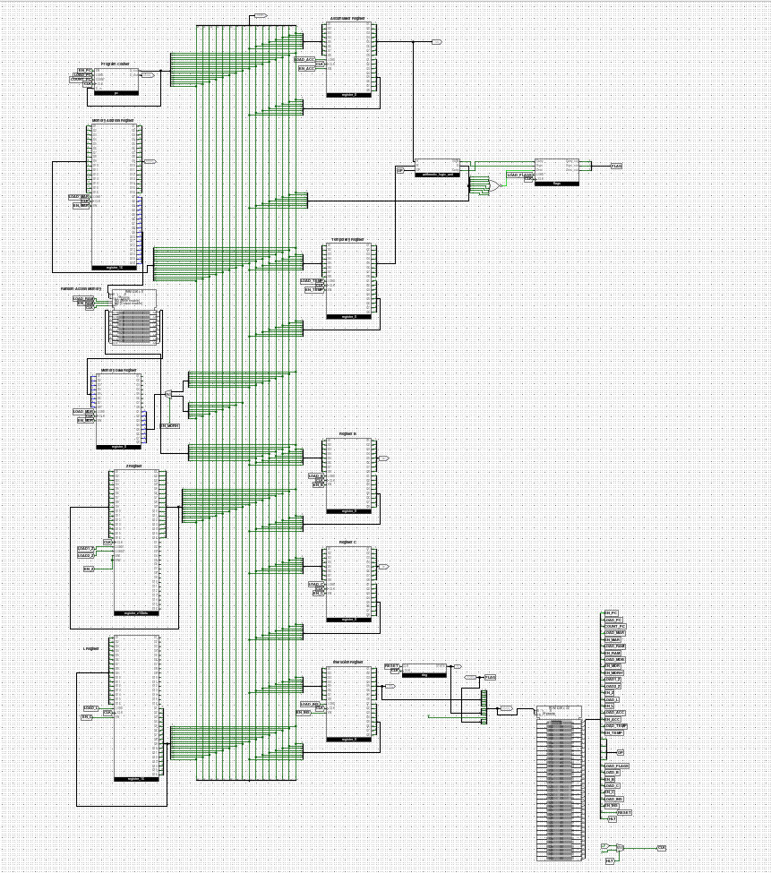
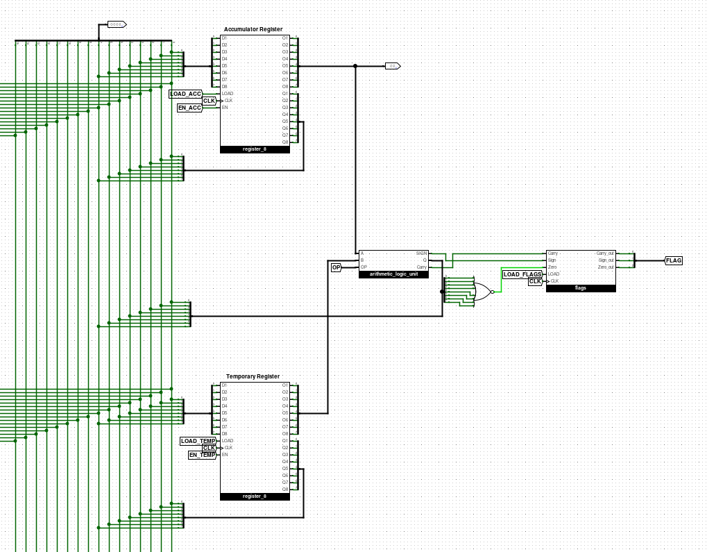
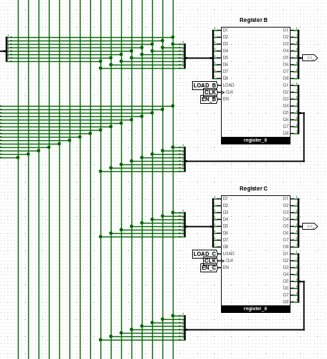
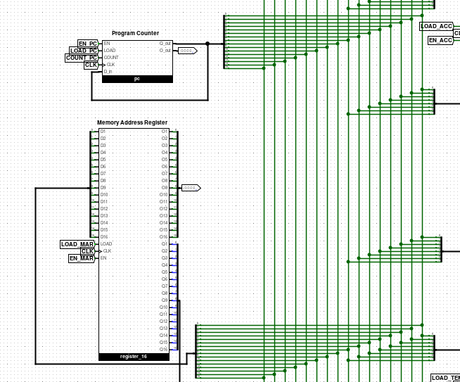
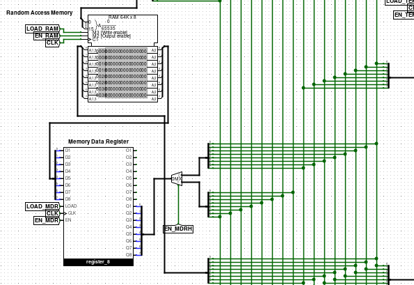
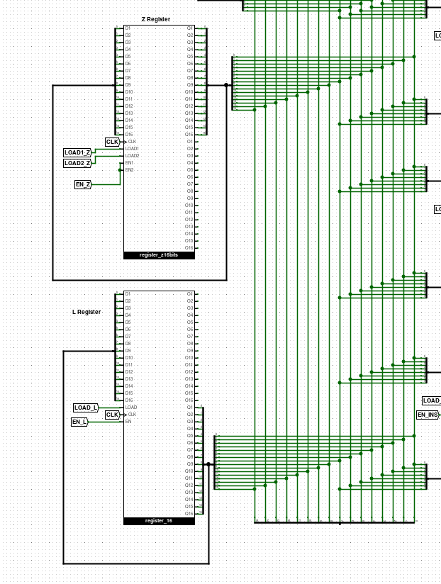
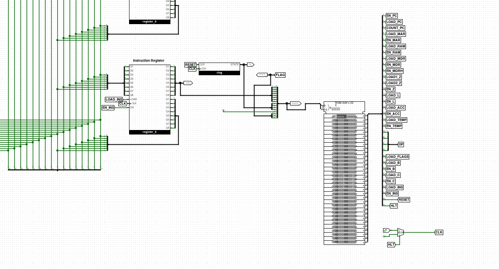

# SAP2
Simple As Possible Computer Architecture as in 'Digital Computer Electronics' by Albert Paul Malvino built using Logisim-Evolution

## WELCOME TO THE SAP-2 COMPUTER MODEL (MODIFIED VERSION)
The SAP - 2 Model can run upto 42 instructions given in the book written by Albert Paul Malvino, but This modified model can only run up to 40 instructions beacause of the lack of input and output peripherals. Due to same reason one has to create a .hex or .txt file in v3.0 hex addressed format and load the image into the Logisim RAM,
The EEPROM microcode control word image is located in the 'SAP2/generator_code/rom.txt' this also has to be loaded in the Logisim ROM before running.
The given computer cannot run the IN and OUT instruction due to the lack of input and output peripherals but can run all the other 40 instructions.

## AIM:
The AIM of this project is self satisfaction and better understanding of computer architecture and how exactly a computer runs code.

## FUNCTIONAL UNITS
### REGISTERS
1. Accumulator: An 8 bit register where 8 bit results arithmetic and logical operations are stored.
2. Register B: A general purpose 8 bit register
3. Register C: A general purpose 8 bit register
4. Temporary Register: Data must be loaded into the 8 bit temporary register before doing binary operations
5. Instruction Register: The OPCODE(8 bits) for the current instruction being executed is stored here
6. Flags Register: The flags register has Sign(S),Zero(Z) and Carry(C)(NOTE: In the original SAP 2 Architecture we do not have carry flags)
7. MAR(Memory Address Register): The 16 bit register MAR stores addresses from where the data needs to be fetched from the RAM
8. MDR(Memory Data): The 8 bit register that temporarily stores data fetched from the RAM
9. Z Register: A special purpose 16 bit register which is used to load the High byte addr and Low byte addr separetely into the Z register
10. Link Register: Temporarily stores the RET addr for a CALL instruction (The SAP-2 Architecture does not have a CPU Stack or a Stack pointer, Only the Link Register is used so nested subroutines are not possible)

### RAM
The RAM(RANDOM ACCESS MEMORY) is 64KB with 16 bit addrs and 8 bit data

### Program Counter
The Program Counter is 16 bit program counter that can be loaded with any addr which will then be used for JMP and CALL instructions

### ALU
The ALU(Arithmetic Logic Unit) can perform the following instructions
1. ADD
2. SUB
3. AND
4. OR
5. XOR
6. NOT
7. Rotate Right (with carry)
8. Rotate Left (with carry)
9. Increment
10. Decrement

Each operation has their repective opcode which is to be given at the OP input of the ALU

### EEPROM
EEPROM is used to generate 32 bit control words for the instructions and fetch cycle

### MORE INFO:
For more information do checkout the routines.txt and rom.txt

## SCREENSHOTS

